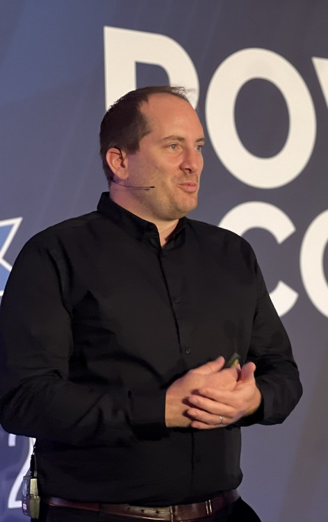

## Interview mit Gael Colas

Gael Colas ist Mitglied der DSC Working Group, einer Gruppe von Microsoft-Mitarbeitern und Community-Mitgliedern, die die Ausrichtung und Weiterentwicklung der "Desired State Configuration" Plattform disktuieren und vorantreiben. Gael hat als unabhängiger Experte zahlreiche DSC-Resourcen entwickelt und setzt sich seit Jahren als die Stimme der DSC-Community für die Weiterentwicklung und Adaption der Technologie ein.

**Frage: DSCv3, zum Erfolg oder zum Scheitern verurteilt?**

Das wird die Zeit zeigen, aber es ist auf jeden Fall eine gewaltige Aufgabe, gerade jetzt, wo Puppet und Chef offenbar auf dem Rückzug sind. Ich bin überzeugt, dass es nach wie vor einen Bedarf für Konfigurationsmanagement gibt, aber DSC v3 ist keine Weiterentwicklung, sondern nur eine andere Herangehensweise an dasselbe Problem.

**Frage: Technologisch gesehen fangen sie komplett neu an. Sie trennen DSC von PowerShell und dem Windows Management Framework.** 

DSCv3 ist eine komplette Neuprogrammierung und unterscheidet sich so stark von PSDSC, dass es eigentlich einen anderen Namen hätte bekommen sollen. Die Community hat zwar um einen anderen Namen gebeten, aber ohne Erfolg. Ich vermute, es war einfacher, es als Weiterentwicklung zu präsentieren, als ein neues „Produkt” einzuführen, das dasselbe wiederholt, aber besser macht.

**Frage: Vor einigen Jahren habe ich Jeffrey Snover nach den Schwächen der Technologie gefragt – insbesondere, ob DSC-Ressourcen nicht von den jeweiligen Produktgruppen bereitgestellt werden sollten.** 

Es ist das altbekannte Problem, das für PowerShell-Module und für DSC-Ressourcen im gesamten Microsoft-Ökosystem gilt. Großartige Produkte mit großartigen Funktionen, aber manchmal ist das Management nur eine Nebensache. Das war schon immer eine Herausforderung und ist ein bekanntes Problem für das PowerShell- oder WinGet-Team.

Eine der Herausforderungen besteht darin, dass die Produktteams auf die Nachfrage der Benutzer warten, um den Bedarf zu erkennen, aber es gibt keine Nachfrage, da es keine offiziellen DSC-Ressourcen für Produkte gibt und jeder daran gewöhnt ist, seine eigene Lösung zu entwickeln.

Wir müssen anerkennen, dass es eine der Motivationen des PowerShell-Teams ist, jede Sprache oder jeden Befehl in DSCv3 zu unterstützen. Sie möchten, dass andere Produktteams die DSC-Ressourcen für ihre Software in der Sprache ihrer Wahl schreiben können, um alle Hindernisse zu beseitigen.

**Frage: Du verwaltest zahlreiche DSC-Community-Ressourcen.Welche Änderungen sind für zukünftige Community-Ressourcen zu erwarten?**

Wir diskutieren noch, wie wir traditionelle PSDSC-Ressourcen in DSCv3 am besten unterstützen und gleichzeitig die vielen neuen Funktionen von v3 unterstützen können. Was die zu erwartenden Änderungen für Community-Ressourcen angeht, so experimentieren wir derzeit noch damit, wie man eine PowerShell-Ressource für DSCv3 am besten schreibt, aber wir hoffen, dass wir einige Authoring-Tools einführen können, die bei der Umstellung helfen.

**Frage: Dinge erscheinen oft verzerrt, wenn man sie aus der eigenen Blase heraus betrachtet. Ich habe DSC immer für übermäßig komplex und elitär gehalten. Wird sich das mit DSCv3 ändern?**

Ich würde argumentieren, dass dies nicht spezifisch für DSC ist, sondern eher für den Bereich Konfigurationsmanagement und Management as Code, die (in unserem Ökosystem) im Vergleich zum breiteren Bereich der PowerShell-Automatisierung eine Nische darstellen. Aber wenn sich Menschen die Mühe gemacht haben, dies aufzubauen, dann deshalb, weil es einen Bedarf gab und immer noch gibt. Einige Systemadministratoren haben wahrscheinlich dasselbe über PowerShell gesagt, bevor es in ihrem Bereich zum Mainstream wurde.

Ich glaube nicht, dass DSCv3 diese Lernkurve ändern kann, da es sich um eine andere Denkweise als bei imperativem Scripting handelt, aber der größte Nachteil von DSCv3 ist derzeit das Fehlen eines Tools höherer Ordnung. DSCv3 ist nur ein Dienstprogramm, das auf einem Knoten ausgeführt wird. Es gibt keine Orchestrierung, keinen Dienst, keine zentrale Verwaltung und keine Berichterstellung, wie wir sie mit PSDSC und dem Pull-Server hatten.

**Frage: Du und andere DSC-Enthusiasten investieren viel Zeit in die DSC-Community. **

Ich glaube, wir DSC-Enthusiasten beschäftigen uns damit, weil wir einen Bedarf sehen oder weil wir neugierig sind, Probleme lösen wollen.

**Frage: Eine letzte Frage: Wird DSCv3 zu einem wichtigen Faktor in der Linux-Welt werden? Vielleicht durch die fortlaufende Integration in Produkte wie Ansible, Puppet oder Chef?**

Tatsächlich könnte DSCv3 verwendet werden, um Änderungen an Systemen vorzunehmen, die von den verschiedenen Lösungen verwaltet werden, und damit den Weg für mehr Linux-Maschinen ebnen, die DSC verwenden. Aber ich glaube nicht, dass das das primäre Ziel ist. Linux-Maschinen verfügen seit Jahrzehnten über ein ausgereifteres und automatisierteres Ökosystem, und derzeit sehe ich kein Problem, das durch die Hinzufügung von DSCv3 gelöst werden könnte. DSCv3 steckt noch in den Kinderschuhen, aber ich denke, dass es in Zukunft zur Verwaltung von Systemen verwendet werden kann, die über eine API konfiguriert werden, wie z. B. Cloud-Dienste, was wir trotz der Einschränkungen des alten Designs bereits mit PSDSC tun.

**Herzlichen Dank für das Gespräch!**

